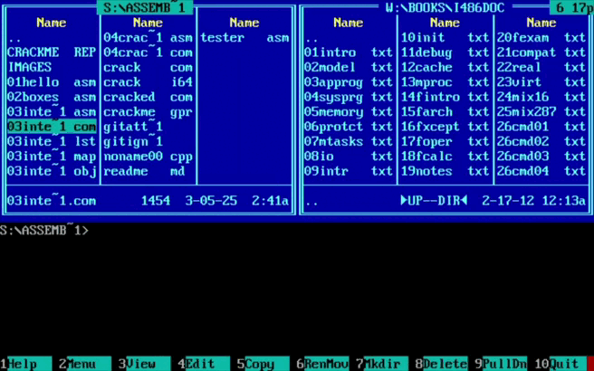

# General information

This repository contains assembler projects in DOSBox.

## 01 Hello

The first program is "**Hello, world!**", but a little different...

## 02 Boxes

The program draws a frame and text in video memory.
The command line takes **5 arguments:** 
1. Frame size in X coordinate (width)
2. Frame size in Y coordinate (height)
3. Color
4. Style number*
5. Line that should be in the frame

Program call example:

```
02Boxes.com 50 10 95 2 "be brave#"
```

**RESULT:**


**\* means a peculiarity:** if you select the style numbered "0", you can set your own frame style of 9 characters. There is an example of a program call:

```
02Boxes.com 60 13 97 0 "(-)( )(-)" "stay hard#"
```

**RESULT:**


## 03 Interrupts

In this program, I intercept hardware interrupts DOS 09h and DOS 08h and set my own handlers for these interrupts. 

**GOAL:** Write a resident program that outputs the state of the processor registers when a key is pressed.

**RESULT:** The program has this functionality:

- Button 'F' - display the frame with registers on the screen (stationary values of registers).
- Button 'T' - start timer, i.e. start updating of register values.
- Button 'D' - delete the frame from the screen.



## 04 CrackMe

СrackMe-program for my course friend [Egor](https://github.com/4Locker4) with several vulnerabilities - final assignment of assembly course in DOS.

Egor also wrote me the similar program. I'm cracking it here: [My Patcher](https://github.com/daniilgriga/Patcher)
